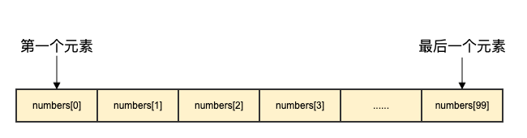

## Go 语言数组

Go 语言提供了数组类型的数据结构。

数组是具有相同唯一类型的一组已编号且长度固定的数据项序列，这种类型可以是任意的原始类型例如整型、字符串或者自定义类型。

相对于去声明 **number0, number1, ..., number99** 的变量，使用数组形式 **numbers[0], numbers[1] ..., numbers[99]** 更加方便且易于扩展。

数组元素可以通过索引（位置）来读取（或者修改），索引从 0 开始，第一个元素索引为 0，第二个索引为 1，以此类推。


#### 声明数组

Go 语言数组声明需要指定元素类型及元素个数，语法格式如下：

> **`var arrayName [size]dataType`**

#### 初始化数组

> **`var numbers [5]int`**
>
> **`var numbers = [5]int{1, 2, 3, 4, 5}`**
>
> **`numbers := [5]int{1, 2, 3, 4, 5}`**

如果数组长度不确定，可以使用 **...** 代替数组的长度，编译器会根据元素个数自行推断数组的长度：

> **`var balance = [...]float32{1000.0, 2.0, 3.4, 7.0, 50.0}`
> `balance := [...]float32{1000.0, 2.0, 3.4, 7.0, 50.0}`**

如果设置了数组的长度，我们还可以通过指定下标来初始化元素：

> **`balance := [5]float32{1:2.0,3:7.0}`**

**注意：**在 Go 语言中，数组的大小是类型的一部分，因此不同大小的数组是不兼容的，也就是说 **[5]int** 和 **[10]int** 是不同的类型。

#### 访问数组元素

数组元素可以通过索引（位置）来读取。格式为数组名后加中括号，中括号中为索引的值。例如：

> **`var salary float32 = balance[9]`**

以下演示了数组完整操作（声明、赋值、访问）的实例：

```go
package main

import "fmt"

func main() {
   var n [10]int /* n 是一个长度为 10 的数组 */
   var i,j int

   /* 为数组 n 初始化元素 */        
   for i = 0; i < 10; i++ {
      n[i] = i + 100 /* 设置元素为 i + 100 */
   }

   /* 输出每个数组元素的值 */
   for j = 0; j < 10; j++ {
      fmt.Printf("Element[%d] = %d\n", j, n[j] )
   }
}
```

#### 更多内容

数组对 Go 语言来说是非常重要的，以下我们将介绍数组更多的内容：

| 内容                                                         | 描述                                            |
| :----------------------------------------------------------- | :---------------------------------------------- |
| [多维数组](https://www.runoob.com/go/go-multi-dimensional-arrays.html) | Go 语言支持多维数组，最简单的多维数组是二维数组 |
| [向函数传递数组](https://www.runoob.com/go/go-passing-arrays-to-functions.html) | 你可以向函数传递数组参数                        |