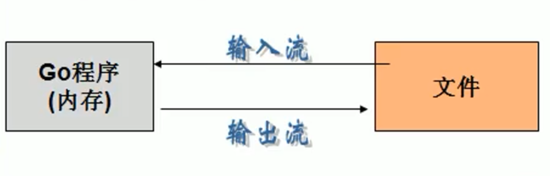

# 文件操作

### 文件的基本介绍

- 文件是数据源的一种，如常见的word文档、txt文本、excel表格、最主要的作用就是保存数据（图片、视频、声音...）

- 文件在程序中是以流的形式来操作的：



- os.File封装所有文件相关操作（os是包，File是一个结构体）

#### 注意：

文件相对路径是从当前位置的根目录处开始寻找的

### 常用的文件操作函数和操作方法

#### 打开文件和关闭文件

1. 打开一个文件进行读操作

   **os.Open(name string) (*File,error)**
   
2. 关闭一个文件

   **file.Close()**

#### 读取文件

**方法一：**

```go
func TestExample1(t *testing.T) {

    //打开文件
    file, err := os.Open("../filedemo.txt")
    if err != nil {
       fmt.Println("open file err =", err)
    }

    //输出下文件，看看文件是什么
    fmt.Printf("file=%v\n", file)

    //创建一个*Reader，是带缓冲的
    reader := bufio.NewReader(file)

    //循环读取文件的内容
    for {
       str, err := reader.ReadString('\n') //读到一个换行就结束

       //输出内容
       fmt.Print(str)

       // io.EOF表示文件的的末尾
       if err == io.EOF {
          break
       }
    }
    fmt.Println("文件读取结束...")

    //关闭文件
    defer file.Close() //要及时关闭file句柄，否则会有内存泄漏
}
```

**方法二：**

```go
func TestExample2(t *testing.T) {

    //使用ioutil.ReadFile一次性将文件读取到位
    file := "../filedemo.txt"
    content, err := ioutil.ReadFile(file)
    if err != nil {
       fmt.Printf("read file err=%v", err)
    }
    //把读取到的内容显示到终端
    fmt.Printf("%v\n", content)       //字节形式
    fmt.Printf("%v", string(content)) //字符串形式
    //我们没有显式的Open文件，因此也不需要显式的Close文件
    //因为，文件的Open和Close被封装到ReadFile函数内部
}
```

#### 创建及写入文件

```go
func main() {

    //创建一个新文件，写入内容 5句"hello, Gardon"
    //打开文件filedemo.txt
    filePath := "../filedemo.txt"
    file, err := os.OpenFile(filePath, os.O_WRONLY|os.O_CREATE, 0666)
    if err != nil {
       fmt.Printf("open file err =%v\r\n", err)
       return
    }

    //及时关闭file句柄
    defer file.Close()

    //准备写入5句”hello,Gardon"
    str := "hello,Gardon\n"
    //写入时，使用带缓存的*Writer
    writer := bufio.NewWriter(file)
    for i := 0; i < 5; i++ {
       writer.WriteString(str)
    }

    //因为writer是带缓存的，因此在调用WriterString方法时
    //是先写入缓存的,所以要调用Flush方法，将缓存的数据写入文件中
    //否则文件会丢失数据！！！
    writer.Flush()
}
```

#### 覆盖原文件

```go
func main() {

	//打开已存在的文件，用新的文本覆盖
	//打开文件filedemo.txt
	filePath := "../filedemo.txt"
	file, err := os.OpenFile(filePath, os.O_WRONLY|os.O_TRUNC, 0666)
	if err != nil {
		fmt.Printf("open file err = %v\r\n", err)
		return
	}

	//及时关闭file句柄
	defer file.Close()

	//准备写入
	str := "你好，无敌西瓜！\r\n"
	//写入时，使用带缓存的*Writer
	writer := bufio.NewWriter(file)
	for i := 0; i < 10; i++ {
		writer.WriteString(str)
	}

	//因为writer是带缓存的，因此在调用WriterString方法时
	//是先写入缓存的,所以要调用Flush方法，将缓存的数据写入文件中
	//否则文件会丢失数据！！！
	writer.Flush()
}
```

#### 文件末尾写入

```go
func main() {

	//打开文件，在末尾追加文本
	//打开文件filedemo.txt
	filePath := "../filedemo.txt"
	file, err := os.OpenFile(filePath, os.O_WRONLY|os.O_APPEND, 0666)
	if err != nil {
		fmt.Printf("open file err = %v\r\n", err)
		return
	}

	//及时关闭file句柄
	defer file.Close()

	//准备写入
	str := "我是超级天才小尾巴\r\n"
	//写入时，使用带缓存的*Writer
	writer := bufio.NewWriter(file)
	for i := 0; i < 5; i++ {
		writer.WriteString(str)
	}

	//因为writer是带缓存的，因此在调用WriterString方法时
	//是先写入缓存的,所以要调用Flush方法，将缓存的数据写入文件中
	//否则文件会丢失数据！！！
	writer.Flush()
}
```

#### 终端读出文件

```go

```

